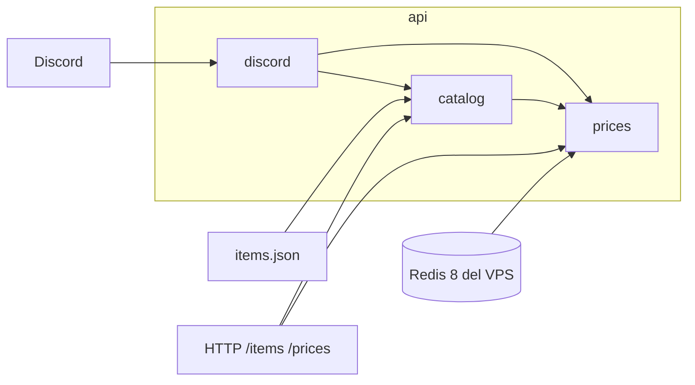

# Arquitectura

## Qué es

Una aplicación NestJS. La entrada es HTTP. La salida es JSON o una interaction response de Discord. Redis solo se lee.



`discord` no arma claves ni conoce el formato de la hash. Llama a los mismos servicios que los controladores HTTP.

## Cómo hacerlo

Nest 11, TypeScript en `strict`. ESLint y Prettier con el preset que deja `nest new`. Nada de configuración propia rara.

```text
api/
  src/
    main.ts
    app.module.ts
    config/env.schema.ts
    catalog/
      catalog.module.ts
      catalog.service.ts
      item-name.index.ts
      item-name.index.spec.ts
      item-query.parser.ts
      item-query.parser.spec.ts
    prices/
      prices.module.ts
      prices.controller.ts
      prices.service.ts
      prices.controller.spec.ts
      price.repository.ts
      cell-key.ts
      cell-key.spec.ts
      icon-url.ts
      icon-url.spec.ts
    discord/
      discord.module.ts
      discord.controller.ts
      discord-signature.guard.ts
      discord-signature.guard.spec.ts
      interaction-handler.service.ts
      embed.builder.ts
      embed.builder.spec.ts
    health/health.controller.ts
  docs/
```

Reglas de código:

- Archivos en kebab-case, una clase principal por archivo. Clases en PascalCase, funciones y variables en camelCase.
- Inglés en todo el código, incluidos los mensajes de error y los comentarios. Un comentario solo si el motivo no se lee en el código.
- El controlador valida el DTO y llama a un servicio. No contiene reglas de negocio.
- Redis queda detrás de `PriceRepository`. El servicio habla de celdas, no de comandos Redis.
- El parser, el índice, `cell-key` y `icon-url` son funciones puras. Se prueban sin levantar Nest.
- Prohibido `any`. Un `unknown` se estrecha en el borde (JSON del catálogo, hash de Redis, body de Discord).
- `ValidationPipe` global con `whitelist`, `transform` y `forbidNonWhitelisted`.
- Dependencias inyectadas por constructor. Nada de singletons importados a mano.

Módulos: `ConfigModule`, `CatalogModule`, `PricesModule`, `DiscordModule`, `HealthModule`. `AppModule` solo los importa.

## Resultado esperado

`npm run start` levanta el HTTP. `GET /health` responde sin Redis. El resto de las rutas fallan con un error claro si Redis o el catálogo no están, y no arrancan a medias.

## Pruebas

Jest, `*.spec.ts` al lado del archivo. `npm test` no abre sockets. Los tests de controlador usan `@nestjs/testing` y un mock de `PricesService` o `CatalogService`. Los tests de dominio no importan `@nestjs/common`.
