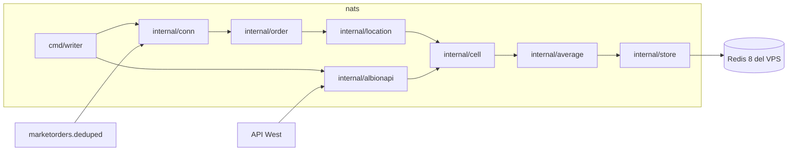

# Arquitectura del módulo

## Qué es

Un proceso Go. La entrada es NATS o el API de Albion. La salida es Redis. No hay HTTP de cara al usuario.



`cell` y `average` no importan NATS, Redis ni HTTP. Ahí vive la regla de negocio y ahí se concentran los tests.

## Cómo hacerlo

Módulo en `nats/go.mod`, path `albion-assistant/nats`, Go 1.23.

Paquetes, tipos, funciones y comentarios van en inglés. Los nombres de ciudad que ya usa Albion (`Caerleon`, `Black Market`) se quedan como están porque son el identificador del dato, no una traducción.

```text
nats/
  cmd/writer/main.go
  internal/config/
  internal/conn/
  internal/order/
  internal/location/
  internal/cell/
  internal/average/
  internal/albionapi/
  internal/store/
  internal/app/        loop que une las piezas
  docs/
```

Dependencias de runtime:

- `github.com/nats-io/nats.go` para la suscripción y la reconexión.
- `github.com/redis/go-redis/v9` contra Redis 8.

Dependencia solo de test: `github.com/alicebob/miniredis/v2`.

Interfaces en el borde, structs en el centro:

```go
type Store interface {
    Apply(ctx context.Context, update cell.Update) error
    Stale(ctx context.Context, olderThan time.Time, limit int) ([]cell.Key, error)
}

type Prices interface {
    Current(ctx context.Context, items []string, cities []string, qualities []int) ([]cell.Update, error)
}
```

`cmd/writer` solo lee config, construye las implementaciones y llama a `app.Run`. Los tests de `app` reciben fakes de `Store`, `Prices` y un canal de órdenes.

Un solo goroutine aplica escrituras. La suscripción NATS empuja a un canal con buffer. Así dos mensajes de la misma celda no se pisan y el test puede inyectar órdenes sin un servidor NATS.

## Resultado esperado

- `api/` puede leer las claves descritas en [redis.md](redis.md) sin conocer NATS.
- Ningún paquete de `internal/cell` o `internal/average` abre sockets.
- Existe una sola réplica de este proceso. Dos réplicas duplicarían la media móvil.

## Pruebas

`go test ./...` desde `nats/`. Tests de tabla en los paquetes puros. El loop de `app` se prueba con fakes: una orden `offer` produce un `Apply` con `SellMin` y `Source: "nats"`. No hay test que marque contra `nats.albion-online-data.com`.
