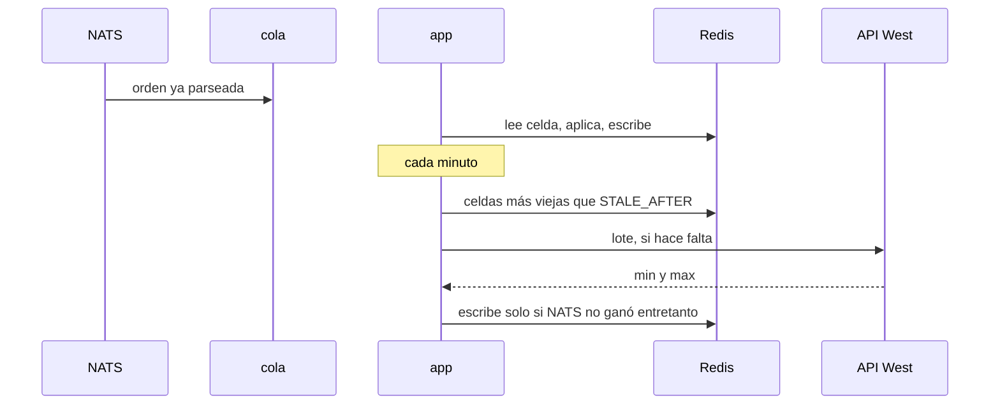

# Proceso

## Qué es

`internal/app.Run` mantiene el programa vivo. Une la suscripción, la cola de órdenes y el ticker del API. `cmd/writer/main.go` solo carga config, construye clientes y cancela el contexto en `SIGINT` y `SIGTERM`.

## Cómo hacerlo

`Run(ctx, deps) error` bloquea hasta que `ctx` se cancela. Al salir, drena la cola un instante corto y cierra NATS y Redis.

Orden dentro del select:

- Orden NATS: `location.City`, si no está en la tabla se ignora, si está se `store.Apply` con source `nats`.
- Tick: arma el respaldo descrito en [respaldo-api.md](respaldo-api.md).
- `ctx.Done`: return nil.

Si `Apply` falla por Redis, se registra y se sigue. Un error de Redis no debe procesar la siguiente orden como si la anterior hubiera quedado escrita: se reintenta esa escritura un número corto de veces y, si sigue fallando, se deja pasar el mensaje. NATS no va a reenviarlo. La celda se corregirá en el próximo mensaje o en el barrido del API.

Salud del contenedor: un archivo o un `GET` no hace falta. El proceso está sano si `Run` sigue bloqueado. Docker usa el proceso principal. Si `Run` retorna por un fallo de config, el contenedor muere y Compose lo reinicia.

Logs en una línea por evento raro (JSON inválido, ciudad desconocida, Redis caído, 429). No se loguea cada orden. El flujo normal es silencioso.

## Resultado esperado

Una orden de Caerleon termina en una hash. Una orden de una isla no toca Redis. Con el contexto cancelado, `Run` vuelve y las conexiones quedan cerradas. Matar NATS no mata el proceso: el tick siguiente usa el API para lo que ya estaba viejo.

## Pruebas

`app/run_test.go` con fakes.

| Caso | Esperado |
|---|---|
| una offer de Caerleon | un `Apply` source nats |
| `LocationId` 4 | cero `Apply` |
| tick con NATS vivo y celda reciente | cero llamadas al API |
| tick con NATS muerto y celda vieja | una llamada al API y un `Apply` source api |
| cancelar el contexto | `Run` retorna nil |
